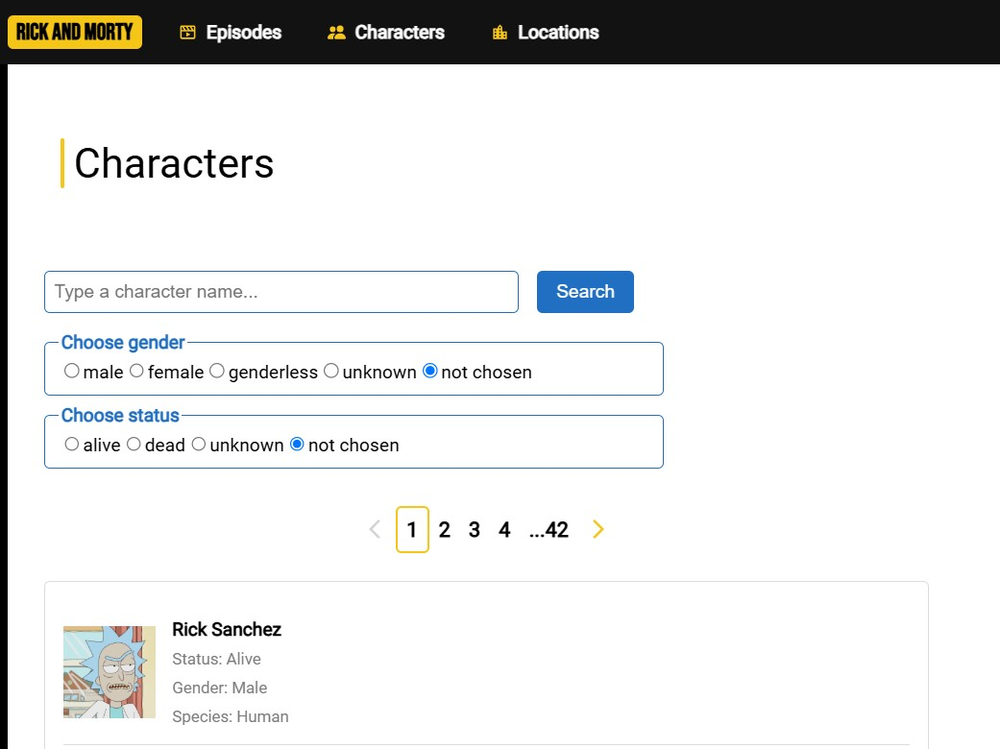

> I am a junior front-end developer.
>
> This is a pet project.

# Project: Rick and Morty

This small project gave me a chance to practise making requests to the Rick and Morty API, which also has a GraphQL component. I based the main UI features on the IMDB design.

## Features

- Browse complete lists of episodes, characters, and locations in their respective sections;
- Click on a specific episode to view detailed information;
- Use filters and the search field to find needed characters.

## Skills used

- GraphQL + Apollo Client
- TypeScript
- Redux + RTK Query
- Next.js
- Scss

## What I learned

- Working with TypeScript;
- Making GraphQL queries using Apollo Client;
- Displaying paginated data (I wrote a nice reusable component for it).

Here you can check out the <a href="https://rick-and-morty-pryhun.netlify.app/" target="_blank">deployed site</a>!
